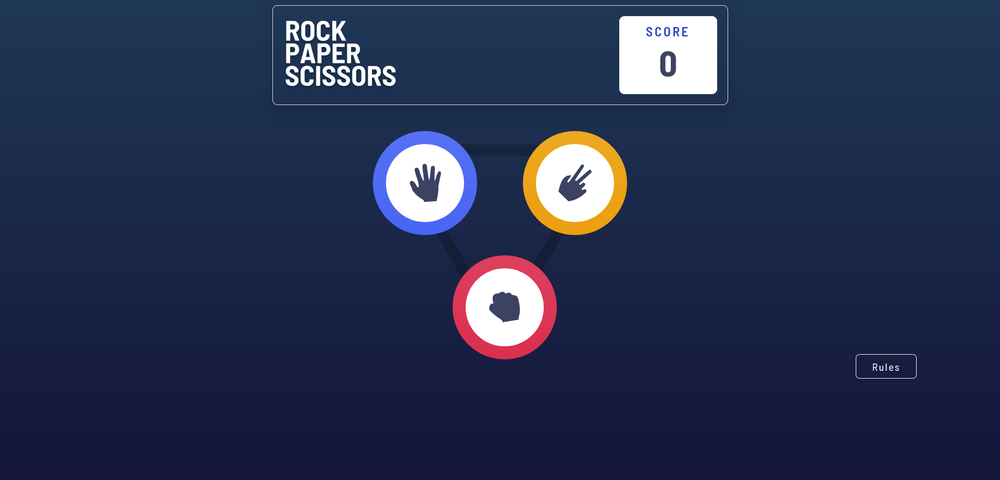

# Rock, Paper, Scissors Game

This is a simple implementation of the classic "Rock, Paper, Scissors" game. The game allows you to play against the computer ("The House") and keeps track of your score. The game is built using HTML, CSS, and JavaScript.

## Table of Contents

- [Design](#design)
- [Features](#features)
- [Usage](#usage)
- [Rules](#rules)
- [Customization](#customization)
- [Technologies Used](#technologies-used)
- [License](#license)
- [Links](#links)
- [Author](#author)

## Design

## Features

- Choose between Rock, Paper, and Scissors.
- The computer randomly picks an option.
- The game determines the winner and displays the result.
- The game keeps track of your score by **session storage**.
- A "Rules" button displays the game rules.

## Usage

- Click on one of the options (Rock, Paper, Scissors) to make your choice.
- The computer will automatically make its choice.
- The game will display the result and update your score.
- Click the "Play Again" button to restart the game.
- Click the "Rules" button to see the game rules.

## Rules

- **Rock** beats **Scissors**.
- **Scissors** beats **Paper**.
- **Paper** beats **Rock**.

If both you and the computer pick the same option, it's a tie.

## Customization

You can customize the appearance of the game by modifying the `css/style.css` file. The images used for the game icons are located in the `images/` directory.

## Technologies Used

- **HTML5**: The structure of the game.
- **CSS3**: Styling and layout of the game.
- **JavaScript**: Game logic and interactivity.
- **Bootstrap**: For responsive design and modal.

## License

This project is open-source and available under the [MIT License](LICENSE).

## Links

- **Repo**: [Github Repo](https://github.com/basemsameh/Rock-Paper-Scissors-Game.git)
- **Demo**: [Live URL](https://basemsameh.github.io/Advice-Generator-App/)

## Author

- **Name**: [Basem](Basem)
- **GitHub**: [GitHub Profile](https://github.com/basemsameh)
- **Linkedin**: [Linkedin](https://www.linkedin.com/in/basem-sameh-671b5b212/)